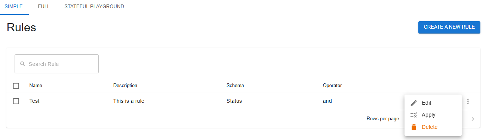
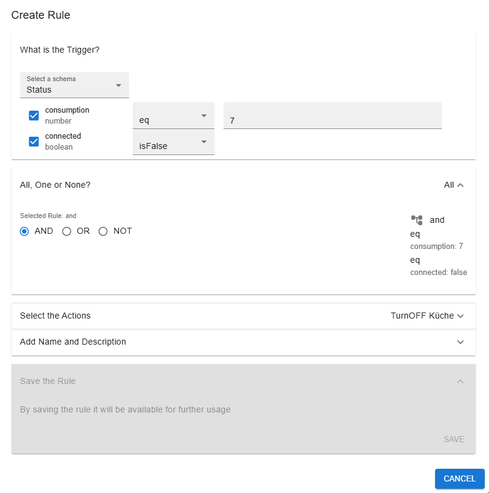
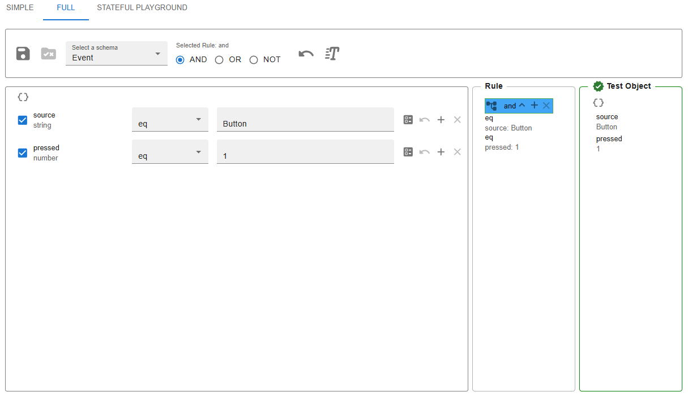
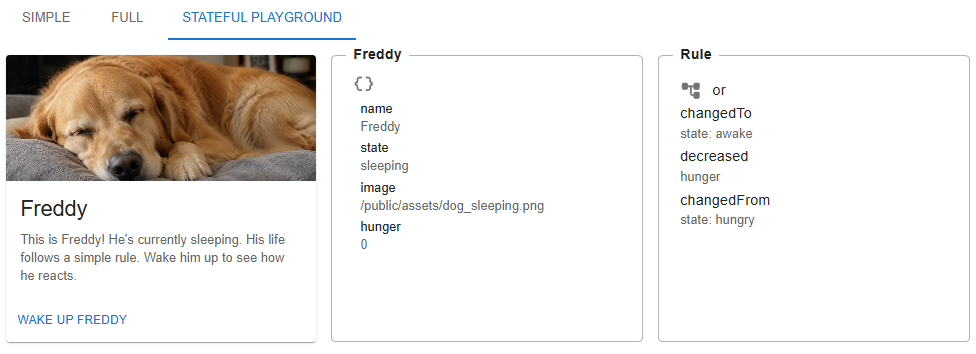

# RuleEngineUI


An userinterface for [Rule-Engine-JS](https://github.com/crafts69guy/rule-engine-js). Based on React and MUI.

## Overview

[Rule-Engine-JS](https://github.com/crafts69guy/rule-engine-js) is a JSON based Rule Engine used to validate / evaluate objects. This means a rule can be used to check if a certain object with certain properties complies to a given rule.
RuleEngineUI (rule-engine-js-ui) offers two visual user interfaces for creating rules for Rule-Engine-JS and a Test Application with many examples how to implement and use them (RuleDesigner).
All of this is based on React and uses MUI for styling. That's why these libraries must be installed in the application that uses this package.

## General features

- **Create rules**<br/>
  Both visual interfaces allow to create rules from reading JSON schemas of objects by converting the object properties to input fields. For every property a rule operator can be selected (e.g. 'eq', 'neq', 'gt', 'contains', isTrue...). The operators correspond to the type of the property (e.g. 'number', 'string', 'boolean').
  While selecting properties and operators, the rule is build in the background and visually presented in the UI.
  Created rules can be saved for later usage by handing them over to the application that uses the UI.

## Features of the Simple UI

- **Assitant like guidance**<br/>
  This UI is intended to create less complex rules (without subrules). The user is led through the process from selecting a schema to saving the rule.

- **Customizable**<br/>
  Addons can be injected into the component to extend the functionality. See the RuleDesigner application for reference.

## Features of the Full UI

- **Complex rules**  
  Here it is possible to create subrules of any depth. Allows also for more than one operator per property.

- **Rule testing while building**<br/>
  While constructing the rule, it is permanently tested against a given test object. The evaluation result is presented visually.

## What to use RuleDesigner for?

- **Implementation examples**<br/>
  It's recommended to use RuleDesigner for learning how to implement RuleEngineJSUI. Examples of objects and schemas are provided, ready to start with the simple- and the full UI. There's also a 'playground' that demonstrates the usage of the stateful engine of [Rule-Engine-JS](https://github.com/crafts69guy/rule-engine-js/blob/production/docs/essentials/stateful-engine.mdx)

  Previously stored rules can be edited and applied to a test object. RuleDesingner also uses a custom interface for executing commands when a given rule was evaluated with a possitive result against an object.

  RuleDesigner is a web application and hence needs a web server to run. In your develop environment you can use Vite to run it.

## Prerequisites

Please install the following peer dependencies, if you want to use RuleEngineJSUI:

```
npm i react react-dom @emotion/react @mui/material
```

## Installation

rule-engine-js-ui on npmjs:<br/>

```
npm i rule-engine-js-ui
```

## Usage

RuleEngineJSUI exports four components that you can import in your application:

- **import { RuleEngineJSUI } from "rule-engine-js-ui";**<br/>
  The two main UI's to create rules. Which interface is loaded depends on the properties you pass to the component. Look at [RuleDesigner](https://github.com/akreienbring/RuleEngineUI/tree/main/RuleDesigner) for a reference implementation of the two interfaces!
- **import { BorderBox } from "rule-engine-js-ui";**<br/>
  A custom box with border, title and icon. Can for example be used to wrap ObjectList and SimpleRuleList
- **import { ObjectList } from "rule-engine-js-ui";**<br/>
  A component that turns an object into a better readable list.
- **import { SimpleRuleList } from "rule-engine-js-ui";**<br/>
  A visual representation of a rule with it's operators
  **import { evaluateRule } from "rule-engine-js-ui";**<br/>
  A function to evaluate both: stateful and stateless rules with given testobjects

## Screenshots








